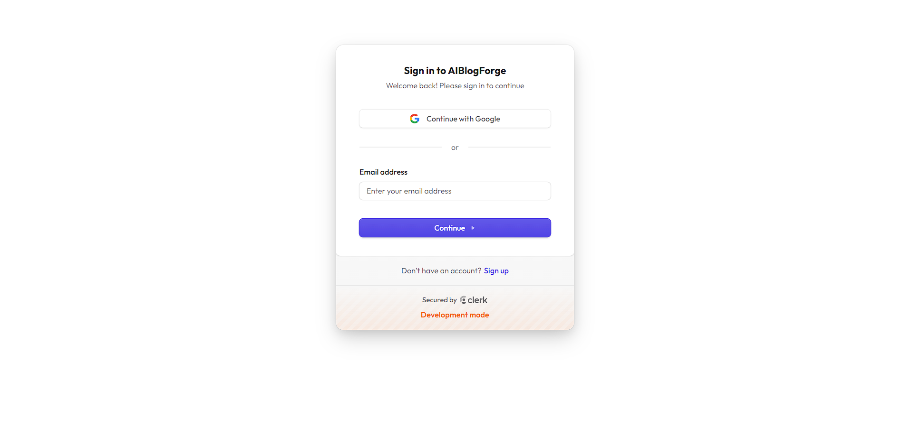
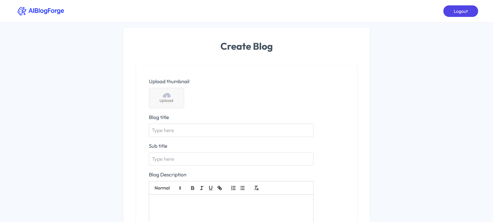
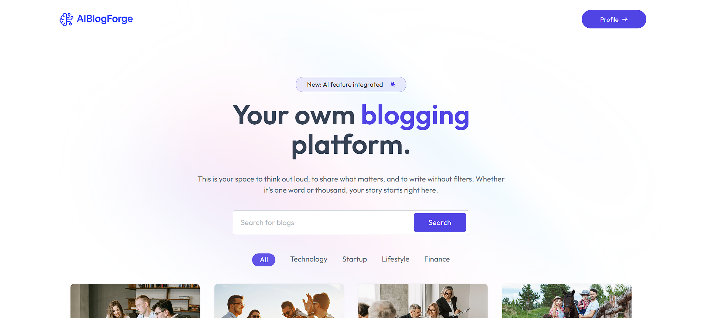
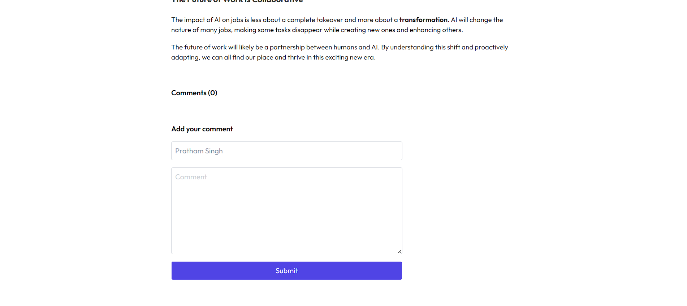

# 🧠 AIBlogForge

AIBlogForge is a full-stack AI-powered blogging platform that allows users to write, publish, and manage their blog posts with intelligent assistance. It integrates OpenAI for content suggestions and real-time editing, with a minimal, modern design built using the MERN stack.

## 🚀 Features  
- 🔑 **Authentication** (Login/Signup with Clerk)  
- 📝 **User Blog Submission** – Users can add blogs through a simple UI  
- 👨‍💼 **Admin Review Flow** – Blogs stay pending until admin approves/rejects  
- 🔍 **Blog Search & Categories** – Filter blogs by category or search keywords  
- 💬 **Comment System** – Engage with blogs via comments  
- 🌐 **Responsive UI** with Tailwind CSS  
- ⚡ **Fast & Scalable** backend with Node.js and Express.js  
- 💾 **Database Support** with MySQL & MongoDB  


## 🛠️ Tech Stack  
- **Frontend:** React.js, Tailwind CSS  
- **Backend:** Node.js, Express.js  
- **Authentication:** Clerk  
- **Database:** MySQL, MongoDB  
- **Deployment:** Vercel 

## 📁 Folder Structure

```
/client         → React frontend  
/server         → Express backend  
/public         → Static files (logo, etc.)
/screenshots    → Screenshots for README  
.env            → Environment variables  
README.md       → Project documentation
```

## 🧑‍💻 Getting Started

### 1. Clone the Repository

```bash
git clone https://github.com/your-username/AIBlogForge.git
cd AIBlogForge
```

### 2. Setup Environment

Create `.env` files for both client and server:

**/server/.env**
```
PORT=3000
MONGO_URI=your_mongodb_uri
OPENAI_API_KEY=your_openai_key
JWT_SECRET=your_jwt_secret
```

### 3. Install Dependencies

```bash
cd client
npm install

cd ../server
npm install
```

### 4. Run Locally

```bash
cd server
npm start

cd ../client
npm run dev
```

Open `http://localhost:3000` in your browser.

## 📸 Screenshots
🔑 Login / Signup

📝 User Blog Submission

👨‍💼 Admin Dashboard (Review Blogs)

🔍 Blog Search & Categories

💬 Comment System


## 🚧 Future Improvements

📊 Analytics dashboard for blog performance

🤖 AI-powered blog suggestions

📱 Mobile app version

## 🙌 Contributing

Contributions are welcome! Feel free to fork the repo and create a pull request.
## 📄 License

This project is open-source and available under the [MIT License](LICENSE).
